<div align="center">

# 👋 Hi, I'm  Burra Shiva Dikshitha 

### `Dikshithab` · she/her

**Full Stack Developer | AI & GenAI Enthusiast | Cybersecurity**

Building modern, responsive and intelligent applications with
**Python · Django · React · AI**

<br>

[](https://github.com/Dikshithab)
[](https://www.linkedin.com/in/burra-shiva-dikshitha-353173350/)
[](https://leetcode.com/u/j3yQ4qr88q/)
[](https://www.codechef.com/users/dikshitha_2230)
[](https://www.hackerrank.com/profile/shivadikshithab1)

</div>

---

<div align="center">

### `shiva@github ~ $ whoami`

</div>

```text
Name       : Shiva Dikshitha Burra
Username   : Dikshithab
Role       : Full Stack Developer

Backend    : Python • Django • Django REST Framework
Frontend   : React • JavaScript
Database   : MySQL

AI         : Generative AI • LLMs • RAG
Security   : Cybersecurity

Currently  : Building intelligent real-world applications
```

---

<div align="center">

## 🛠️ Tech Stack

### Languages


### Full Stack


### AI & Developer Tools


</div>

---

<div align="center">

## 🚀 Featured Projects

</div>

### 💼 HireSphere

**AI-powered job portal** designed to connect job seekers with relevant opportunities.

* 🔐 Authentication & role-based access
* 📄 Resume upload and analysis
* 🤖 AI-powered ATS analysis
* 🔎 Advanced job search
* 💬 AI interview preparation
* ⚛️ React frontend
* 🐍 Django REST backend

---

### 📋 AI-Powered Kanban

A modern project-management platform that goes beyond traditional Kanban boards.

* 📊 Project and task management
* 🧠 AI-powered project health analysis
* ⚠️ Risk identification
* 💡 Intelligent recommendations
* 📈 Productivity insights
* ⚛️ React + Django REST + Groq AI

---

### 🔐 CipherVault

A secure file encryption application built with Python.

* 🔒 File encryption/decryption
* 🔑 Secure key generation
* 🐍 Flask backend
* 🛡️ Fernet encryption
* 🌙 Modern dark UI

---

<div align="center">

## 🎯 Currently Learning

```text
Python Full Stack
       ↓
Django & REST APIs
       ↓
Generative AI
       ↓
RAG & LLM Applications
       ↓
AI Agents
       ↓
Production AI Applications
```

</div>

---

<div align="center">

## 📈 GitHub Contributions



</div>

---

<div align="center">

## 💻 Developer Terminal

```text
shiva@github:~$ echo "Keep building."

> Learn
> Build
> Break
> Debug
> Improve
> Repeat 🚀
```

<br>

### Let's build something meaningful together.

</div>
